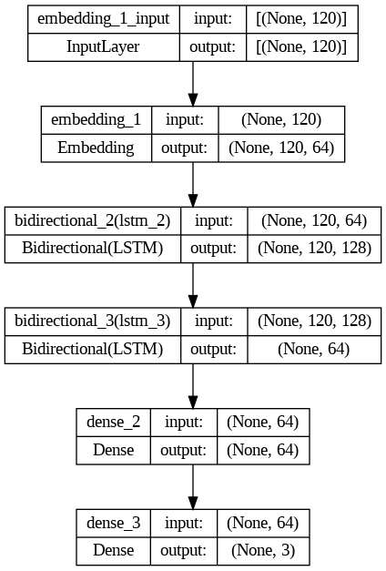
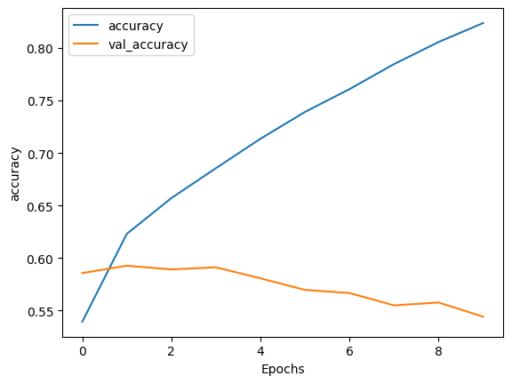
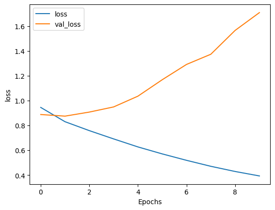
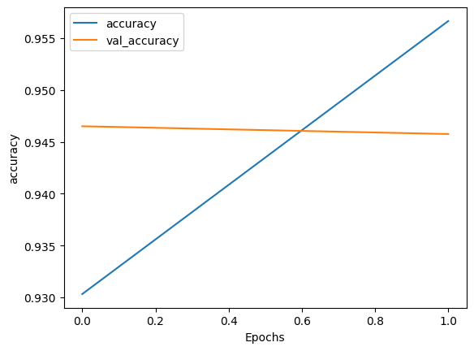
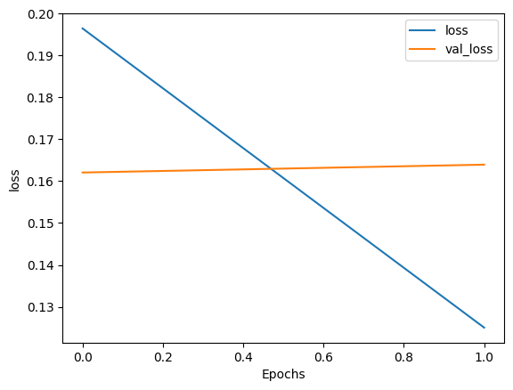

# Sentiment Stance Detection
The following project contains code and demo of CS455 course where we have prepared a sentiment and stance prediction models respectively to effectively analyse the standing and emotion of the person on Climate Change Data

## Evironment Setup
```
conda create -n nlp -f environment.yaml
```

## Run
Local Mode
```
streamlit run app.py
```
Deployment Mode
```
streamlit run app.py --server.port=8001
```


## Model Architecture



## Results

### Sentiment




### Stance




